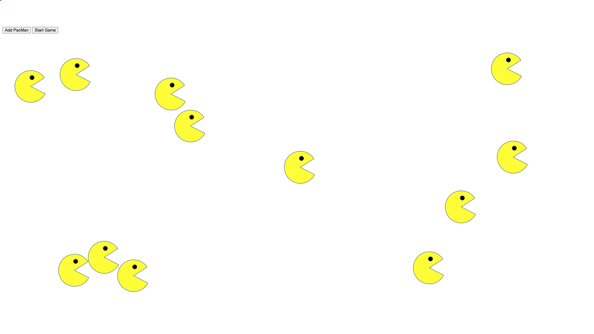

<h1 align="center">PacMen Exercise</h1>

<h4 align="center">This exercise shows use of javascript to create images on demand and making them move.</h4>

 

### Description 

- This exercise generates image of the classic PacMan game on-demand with the click of a button.

- When the ***Add PacMan button*** is clicked, it triggers an on-click event and a new pacmen is generated and is given a random velociy and position.
  
- PacMan images generated randomly bounce around the walls of the screen with the click of ***Start Game*** button. This is made possible by using a forEach function which updates position of PacMan on the x and y axis every 20ms.
  
- Finally, collision detection, allows the pacmen to stay within the browser window.  When a given PacMan hits     the edge of the screen, it changes position to stay within the frame of the web page.   

### To Run this Program

In order to run this file, Fork and Clone the repository to your local machine and open the index.html file in a browser.

- Click the Add PacMan button at the top left-hand side of the screen to create PacMan. A new PacMan should                      appear at a random position on the screen. You can create as many as you want.

- Click the Start Game button, to see the PacMan or PacMen moving in random directions and at random velocity across the screen. 

### Future RoadMap

This project can be still be enhanced by 

- making the PacMen images change color as they change directions.
- Popping PacMan which hits the wall.
  
### License

This exercise stems from MIT xPRO Professional Certificate in Coding: Full Stack Development with MERN Program

> MIT License

> Copyright (c) 2022 Sujatha Arunagiri

> Permission is hereby granted, free of charge, to any person obtaining a copy
> of this software and associated documentation files (the "Software"), to deal
> in the Software without restriction, including without limitation the rights
> to use, copy, modify, merge, publish, distribute, sublicense, and/or sell
> copies of the Software, and to permit persons to whom the Software is
> furnished to do so, subject to the following conditions:

> The above copyright notice and this permission notice shall be included in all
> copies or substantial portions of the Software.

> THE SOFTWARE IS PROVIDED "AS IS", WITHOUT WARRANTY OF ANY KIND, EXPRESS OR
> IMPLIED, INCLUDING BUT NOT LIMITED TO THE WARRANTIES OF MERCHANTABILITY,
> FITNESS FOR A PARTICULAR PURPOSE AND NONINFRINGEMENT. IN NO EVENT SHALL THE
> AUTHORS OR COPYRIGHT HOLDERS BE LIABLE FOR ANY CLAIM, DAMAGES OR OTHER
> LIABILITY, WHETHER IN AN ACTION OF CONTRACT, TORT OR OTHERWISE, ARISING FROM,
> OUT OF OR IN CONNECTION WITH THE SOFTWARE OR THE USE OR OTHER DEALINGS IN THE
> SOFTWARE.

  

